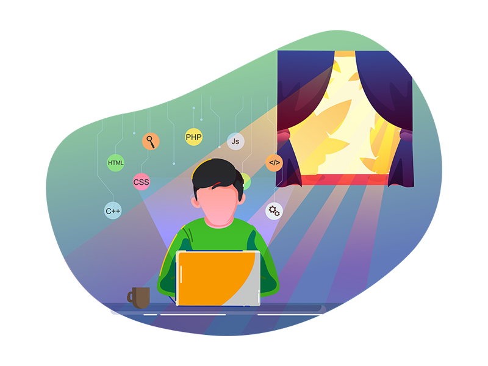

### Fala geeks, tudo bem? 👋

  Meu nome é Marco Almeida, sou graduado em <strong>Análise e Densevolvimento de Sistemas</strong> pelo IFNMG - Campus Januária. Estou cursando pós graduação em <strong>Gestão de Tecnologia da Informação</strong> e trabalho atualmente como desenvolvedor React Native. Trabalho com desenvolvimento há 2 anos e adquiri diversos conhecimentos durante esse tempo, inclusive um amor incondicional pela stack <strong>NodeJS/React/React Native.</strong>🚀
  

   ⚡ Novidades: <strong>No momento estou me aprofundando em NextJS!</strong>

<!--
**marcoalvesalmeida/marcoalvesalmeida** is a ✨ _special_ ✨ repository because its `README.md` (this file) appears on your GitHub profile.

Here are some ideas to get you started:

- 🔭 I’m currently working on ...
- 🌱 I’m currently learning ...
- 👯 I’m looking to collaborate on ...
- 🤔 I’m looking for help with ...
- 💬 Ask me about ...
- 📫 How to reach me: ...
- 😄 Pronouns: ...
- ⚡ Fun fact: ...
-->
